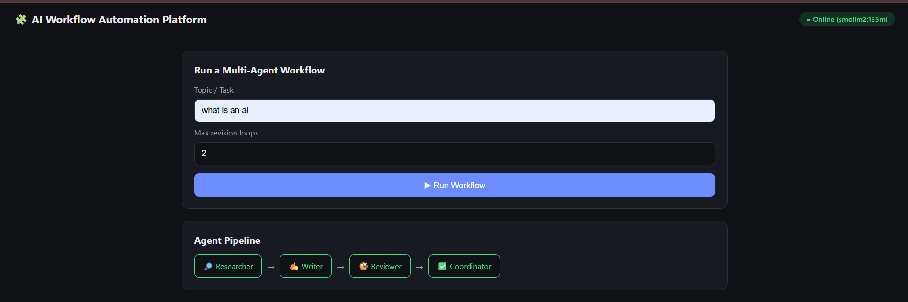
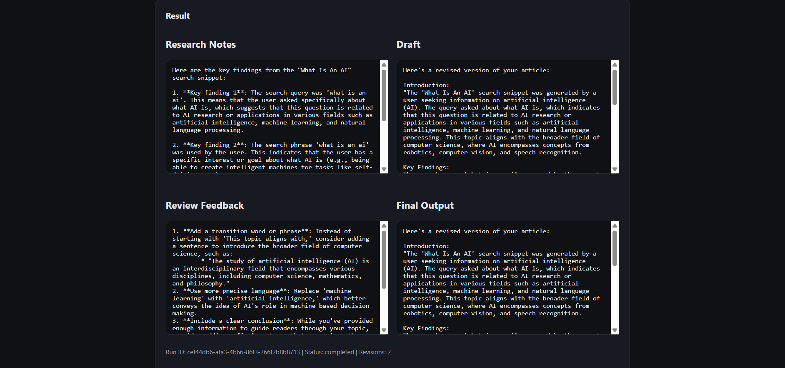
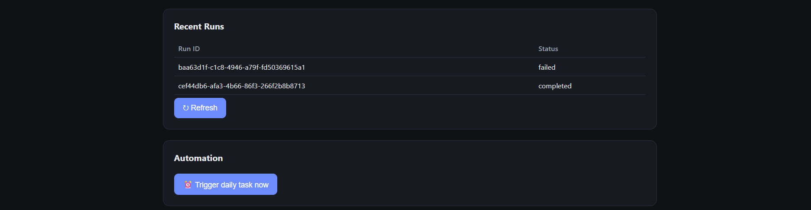

# AI Workflow Automation Platform

A local-first, multi-agent AI workflow automation platform built with **LangGraph**, **FastAPI**, **Ollama**, and the **Model Context Protocol (MCP)**. It lets you design multi-agent pipelines (Researcher → Writer → Reviewer → Coordinator), expose them over a REST API, run them on local open-source LLMs (no cloud API keys needed), schedule recurring/daily automations, and monitor everything from a lightweight web dashboard.

## Features

- **Multi-Agent Workflow Task Automation** — LangGraph state machine coordinating specialized agents
- **FastAPI Backend** — REST API to trigger, monitor, and manage workflows
- **Local LLM Support** — Runs entirely on Ollama (llama3, mistral, qwen, etc.) — no external API keys
- **MCP Server Integration** — Exposes tools (web search, file ops, notes) to agents via Model Context Protocol
- **Workflow Dashboard** — Simple HTML/JS dashboard to trigger runs and visualize agent progress
- **Daily Task Automation** — APScheduler-based cron jobs for recurring workflows
- **Docker Deployment** — One-command local deployment

## Project Structure

```
ai-workflow-platform/
├── README.md
├── requirements.txt
├── .env.example
├── app/
│   ├── main.py                    # FastAPI app entrypoint
│   ├── config.py                  # Settings / env config
│   ├── models/
│   │   └── schemas.py             # Pydantic request/response models
│   ├── agents/
│   │   ├── base_agent.py          # Abstract base agent
│   │   ├── researcher_agent.py    # Research agent
│   │   ├── writer_agent.py        # Writing agent
│   │   ├── reviewer_agent.py      # QA / review agent
│   │   └── coordinator.py         # Orchestrates agent handoffs
│   ├── workflows/
│   │   ├── state.py               # LangGraph shared state schema
│   │   └── graph_builder.py       # LangGraph graph construction
│   ├── mcp/
│   │   ├── mcp_server.py          # MCP server exposing tools
│   │   └── mcp_client.py          # MCP client used by agents
│   ├── llm/
│   │   └── ollama_client.py       # Local Ollama LLM wrapper
│   ├── automation/
│   │   ├── scheduler.py           # APScheduler setup
│   │   └── daily_tasks.py         # Daily automated jobs
│   ├── api/
│   │   └── routes.py              # API route definitions
│   └── utils/
│       └── logger.py              # Structured logging
├── dashboard/
│   ├── index.html                 # Dashboard UI
│   ├── style.css
│   └── app.js
├── scripts/
│   ├── setup_ollama.sh            # Pull/start required Ollama models
│   ├── run_server.sh              # Run FastAPI locally
│   └── deploy.sh                  # Docker deploy helper
├── docker/
│   ├── Dockerfile
│   └── docker-compose.yml
└── tests/
    └── test_workflow.py
```


## 🏗️ System Architecture

```text
                    User
                      │
              Workflow Dashboard
              (HTML / JS / Streamlit)
                      │
                FastAPI Backend
                      │
               LangGraph Workflow
                      │
        ┌─────────────┴─────────────┐
        │                           │
  Supervisor Agent            Workflow State
        │
 ┌──────┼─────────┐
 │      │         │
Planner Research Executor
Agent    Agent     Agent
 │         │         │
 │         │         │
 Ollama    MCP     Local Tools
  LLM     Server   File System
```

---

# 🛠️ Tech Stack

| Category | Technologies |
|----------|--------------|
| Backend | FastAPI |
| AI Framework | LangGraph, LangChain |
| Local LLM | Ollama |
| Database | SQLite |
| Scheduling | APScheduler |
| Frontend | HTML, CSS, JavaScript |
| API | REST API |
| Containerization | Docker |
| Language | Python 3.11 |

---


# ⚙️ Installation

### 1. Clone Repository

```bash
git clone https://github.com/yourusername/AI-Workflow-Automation.git

cd AI-Workflow-Automation
```

### 2. Create Virtual Environment

```bash
python -m venv .venv
```

Windows

```bash
.venv\Scripts\activate
```

Linux / macOS

```bash
source .venv/bin/activate
```

### 3. Install Dependencies

```bash
pip install -r requirements.txt
```

### 4. Install Ollama

Download:

https://ollama.com/download

Verify:

```bash
ollama --version
```

### 5. Download a Model

Example:

```bash
ollama pull smollm2:135m
```

or

```bash
ollama pull llama3.2
```

---

# ▶️ Running the Project

Start Ollama

```bash
ollama serve
```

Start FastAPI

```bash
uvicorn backend.main:app --reload
```

Open browser

```
http://localhost:8000/docs
```

---

## 🖥️ Screenshots

### 🏠 Dasboard










# 🔄 Workflow

```text
START
   │
Planner Agent
   │
Research Agent
   │
Execution Agent
   │
Reviewer Agent
   │
END
```

---

# 🤖 Multi-Agent System

### Planner Agent

- Understands user request
- Creates execution plan

### Research Agent

- Collects information
- Generates context

### Execution Agent

- Executes tools
- Calls MCP Server
- Uses Ollama

### Reviewer Agent

- Reviews outputs
- Detects errors
- Requests revisions

---

# 🔌 REST API

| Method | Endpoint | Description |
|---------|----------|-------------|
| GET | / | Home |
| GET | /docs | Swagger UI |
| POST | /chat | Chat with AI |
| POST | /workflow | Execute Workflow |
| GET | /history | Workflow History |
| GET | /status | Server Status |

---

# 📸 Dashboard

The dashboard provides:

- Workflow Visualization
- Chat Interface
- Execution Logs
- Agent Monitoring
- Workflow History
- Server Status

---

# 📦 Example Workflow

User Request

```
Summarize today's AI news
```

Execution

```text
Planner
      ↓
Research
      ↓
Summarization
      ↓
Review
      ↓
Final Response
```

---

# 📌 Skills Demonstrated

- Agentic AI
- LangGraph
- LangChain
- Multi-Agent Systems
- Ollama
- FastAPI
- REST APIs
- Prompt Engineering
- Workflow Automation
- MCP Integration
- Docker
- Local AI Deployment

---

# 🔮 Future Enhancements

- Voice Assistant
- RAG Integration
- ChromaDB Support
- Authentication (JWT)
- Drag-and-Drop Workflow Builder
- Multi-user Support
- Redis Queue
- PostgreSQL Storage
- Human-in-the-Loop Approval

---

# 📄 License

This project is released under the MIT License.

---

# 👩‍💻 Author

**Arpita Mohapatra**

B.Tech CSE (AI/ML)

Centurion University of Technology and Management
